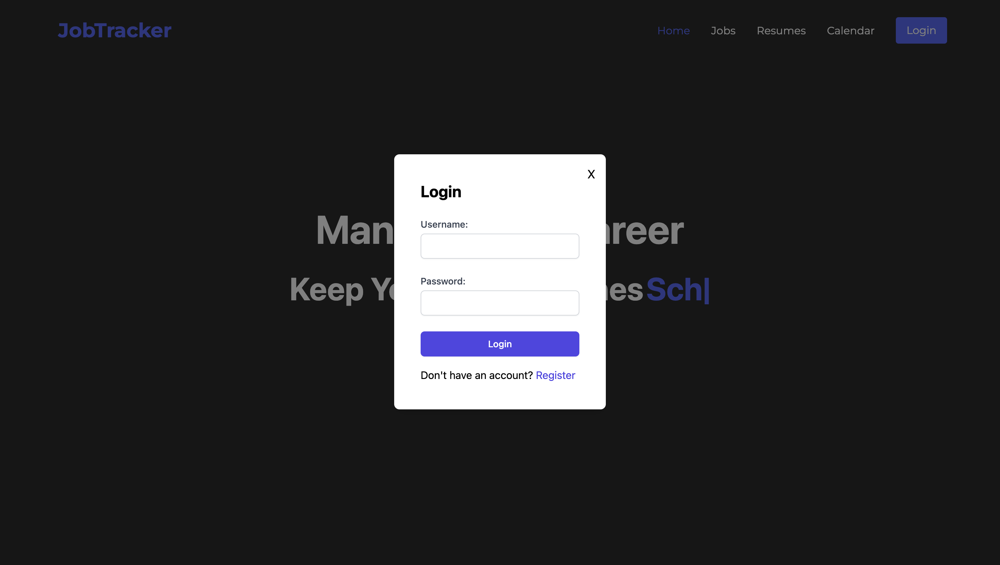
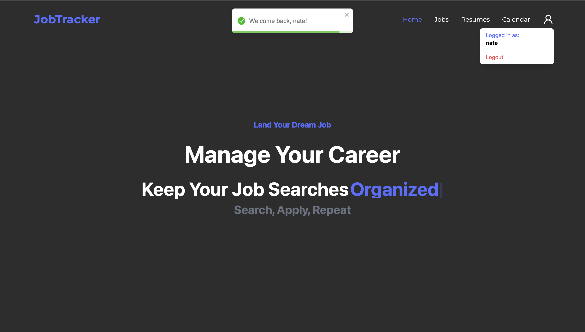
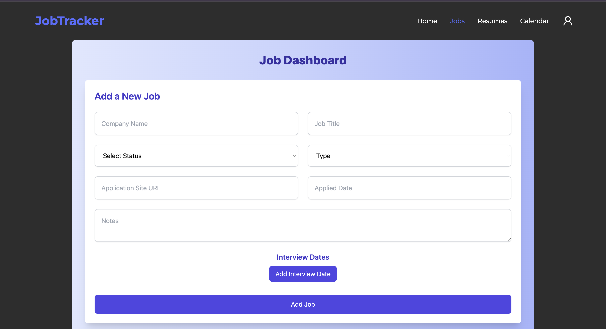
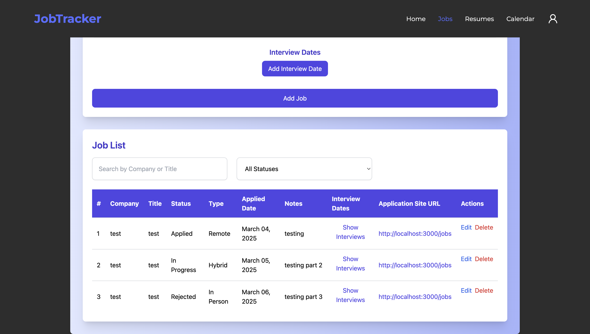
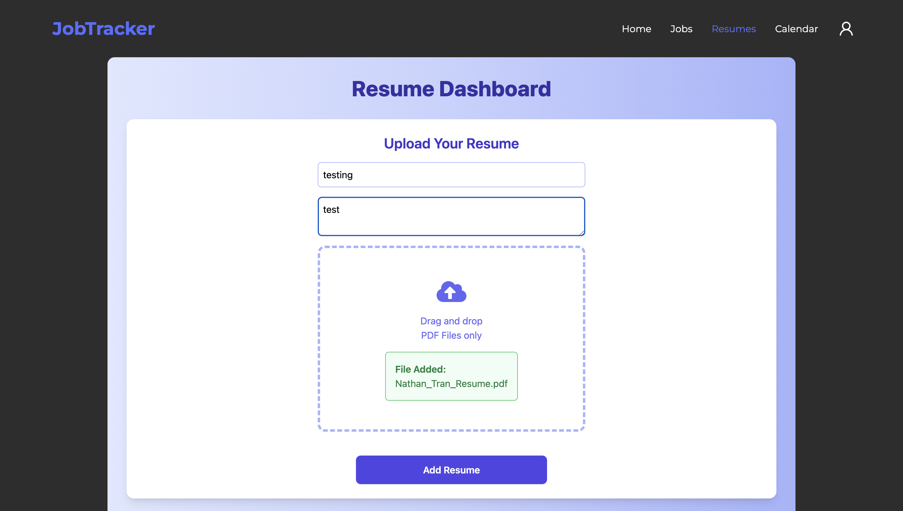
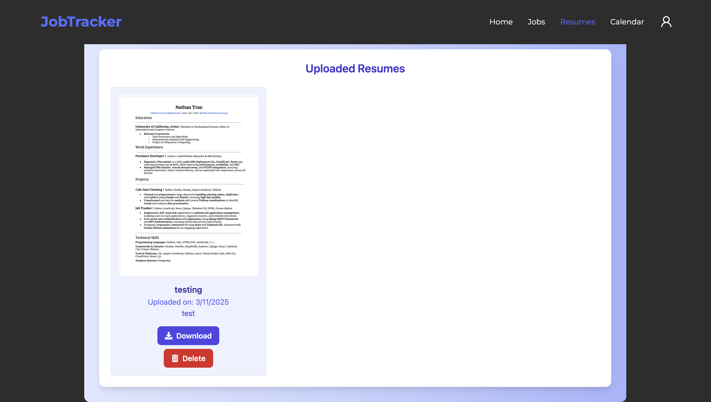
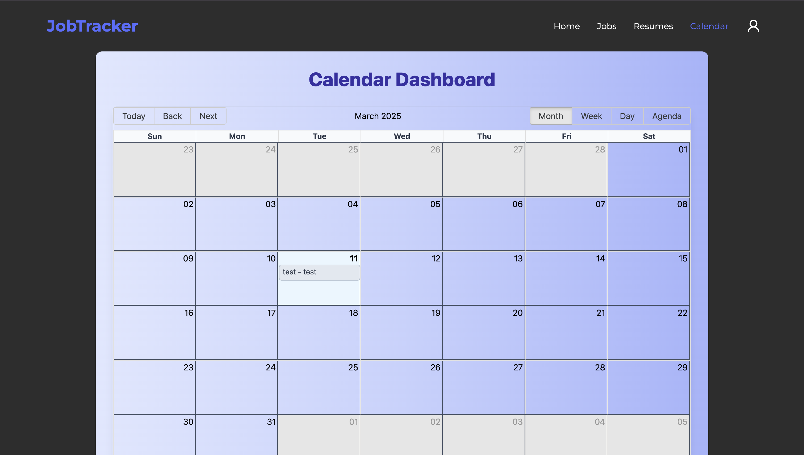
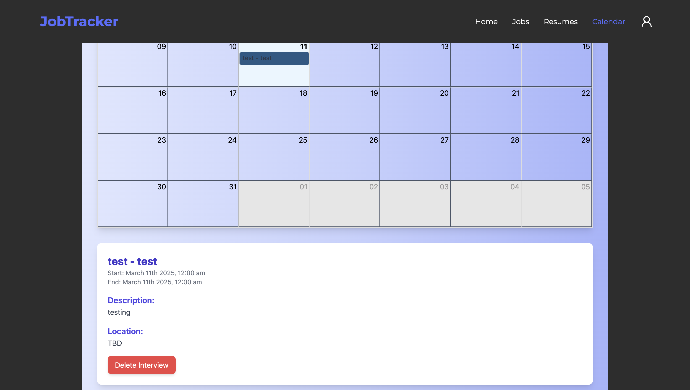

# Job Tracker Application

## Overview
The Job Tracker Application is a full-stack web application designed to help users manage their job applications, resumes, and interview schedules efficiently. It provides a user-friendly interface for tracking job applications, uploading resumes, and scheduling interviews.

## Features
- **User Authentication**: Secure user authentication using JWT.
 

- **Job Management**: Add, edit, and delete job applications.
 

- **Resume Upload**: Upload and manage resumes.
 

- **Interview Scheduling**: Schedule, view, and delete interview dates.
 

- **Responsive Design**: Mobile-friendly interface.

## Technologies Used
- **Frontend**: React, React Big Calendar, Axios, Toastify
- **Backend**: Django, Django REST Framework
- **Database**: SQLite (default), can be configured for PostgreSQL, MySQL, etc.
- **Authentication**: Django REST Framework Simple JWT
- **Styling**: Tailwind CSS

### Prerequisites
- Python 3.x
- Node.js and npm
- Virtualenv (optional but recommended)

### Backend Setup
1. Clone the repository:
   ```bash
   git clone https://github.com/yourusername/JobTracker.git
   cd JobTracker/backend

2. Create a virtual environment and activate it:
   ```bash
   python -m venv venv
   source venv/bin/activate 

3. Install the required packages
   ```bash
   pip install -r requirements.txt

4. Apply migrations:
   ```bash
   python manage.py migrate

5. Create a superuser:
   ```bash
   python manage.py createsuperuser

6. Run the development server
   ```bash
   python manage.py runserver

### Frontend Setup
1. Navigate to the frontend directory
   ```bash
   cd ../frontend

2. Install the required packages
   ```bash
   npm install

3. Start the development server
   ```bash
   npm start

### Usage
1. Open your browser and navigate to http://localhost:3000 for the frontend and http://localhost:8000/admin for the Django admin panel.

2. Register a new user or log in with the superuser credentials.

3. Start adding job applications, uploading resumes, and scheduling interviews.

### API Endpoints
**Job Management**
  - GET /api/jobs/: List all jobs
  - POST /api/jobs/: Create a new job
  - GET /api/jobs/:id/: Retrieve a job
  - PUT /api/jobs/:id/: Update a job
  - DELETE /api/jobs/:id/: Delete a job

**Resume Management**
  - GET /api/resumes/: List all resumes
  - POST /api/upload_resume/: Upload a new resume

**Interview Management**
  - GET /api/interview_dates/: List all interview dates
  - DELETE /api/jobs/:job_id/interview_dates/:interview_index/: Delete an interview date

**Authentication**
  - POST /api/register/: Register a new user
  - POST /api/token/: Obtain a JWT token
  - POST /api/token/refresh/: Refresh a JWT token
